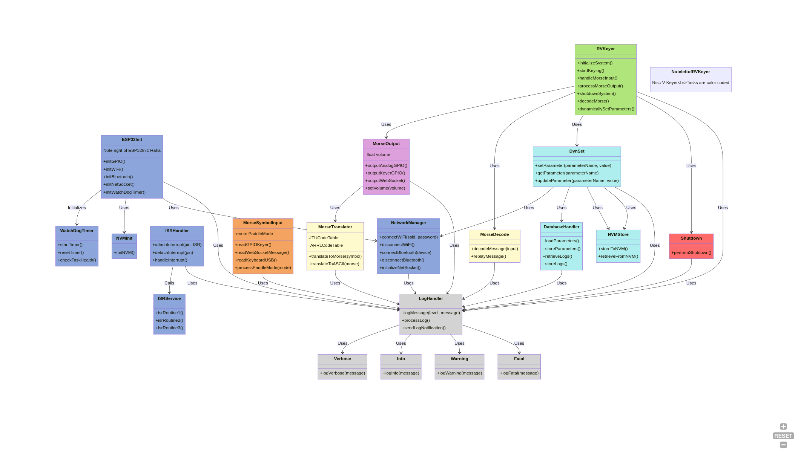

# Risc-V-Keyer: A Modern Morse Code Keyer

Welcome to the Risc-V-Keyer project! This is an open-source initiative to develop a highly customizable Morse code keyer based on the ESP32-C6-Devkit-1. We aim to build a powerful yet minimalistic keyer that leverages modern software engineering practices. Whether you're a seasoned developer or just starting out, we welcome your contributions!

## Table of Contents

- [Project Overview](#project-overview)
- [Hardware Choices](#hardware-choices)
- [GUI or HMI Philosophy](#gui-or-hmi-philosophy)
- [Software Engineering Approach](#software-engineering-approach)
- [Software Design](#software-design)
- [Getting Started](#getting-started)
- [Contributing](#contributing)
- [License](#license)

## Project Overview

The Risc-V-Keyer project aims to create a fully functional Morse code keyer using the ESP32-C6-Devkit-1. This project is perfect for those who are interested in embedded systems, Morse code enthusiasts, or anyone looking to contribute to an open-source hardware project. We follow a top-down software design approach, ensuring that every step is carefully planned and executed.

## Hardware Choices

### Minimal HW Based Solely on the ESP32-C6-Devkit-1

The hardware setup is designed to be minimal yet powerful, using only the ESP32-C6-Devkit-1. This ensures accessibility and simplicity while allowing for a wide range of functionalities.

### Inputs

- **Keyer**: The primary input method is through the keyer, enabling the generation of Morse code.
- **Keyboard**: Input can also be done through a keyboard connected via the ESP32-C6’s USB interface, offering versatility in operation.

### Outputs

- **Audio Level AUX**: For external audio output.
- **Speaker (3W)**: A built-in audio amp output for immediate feedback and use.
- **Keyer (Transceiver Input, Isolated)**: The keyer output is designed to interface with a transceiver, ensuring isolated and safe communication.

### Connectivity

- **WiFi and Bluetooth**: Utilizing the ESP32-C6’s integrated WiFi and Bluetooth capabilities for seamless connectivity with external devices.

### Customization

- **CallSign and Defaults**: Customize the device with your callsign and other settings. These configurations are securely stored using irreversible OTP in the eFuse, ensuring they remain constant once set.

## GUI or HMI Philosophy

### Minimal HW

The hardware setup remains minimal, focusing on essential functionalities, keeping the device user-friendly and efficient.

### Extensive HMI on Host System

The Human-Machine Interface (HMI) is extended to the host system (Desktop, Laptop, and later Mobile devices). This approach allows for more complex interactions and configurations to be handled by the host system, keeping the device itself simple.

### Device Persistence on Device Flash

All settings and states are stored persistently on the device’s flash memory, ensuring that configurations are retained across sessions.

## Software Engineering Approach

### GitHub Use Mandatory

- **Install GitHub Desktop**: Make sure you have GitHub Desktop installed and configured.
- **Learn GitHub**: Understanding how to use GitHub effectively is crucial for collaboration.

### Commit and Pull Frequently

To ensure smooth collaboration, frequent commits and pulls are necessary. This minimizes conflicts and keeps everyone on the same page.

### Top-Down Design Approach

Following the principles from **Jacob Bengio’s "Embedded Software Design"**, we adopt a top-down approach, ensuring that the architecture is solid before delving into coding.

Jacob's book is strongly recommended, if you want to delve deeper into State-of-the-Art Real-Time SW development.

### Architecture First, Coding by ChatGPT

We start with a robust architecture design, followed by implementing the code with the help of ChatGPT. This ensures consistency and adherence to best practices.

#### Initial class diagram. To be refactored according to work in progress.

### Design Flow

- **Requirements**: Clearly define what the project needs to accomplish.
- **Architecture**: Design a solid foundation for the project.
- **UML Diagrams**: Visualize the architecture using UML diagrams generated by ChatGPT.
- **KI Coding**: Implement the code with ChatGPT’s assistance.
- **Testing**: Test thoroughly before each commit.

### Diagrams in Mermaid or PlantUML

All UML diagrams will be created using Mermaid or PlantUML by ChatGPT. This keeps the design process visual and accessible.

### Frequent Refactoring

Refactor code regularly to ensure it remains clean, efficient, and maintainable.

### Read the Docs

Regularly refer to the ESP32-C6 Reference Manual and other relevant documentation.

### Share Your Prompting History

Sharing the prompts you use with ChatGPT helps the community understand your thought process and learn from it.

### Full Project Scaffolding

Scaffold the entire project upfront, creating all classes with placeholder functions (void methods) for the features not yet fully defined. This approach allows you to have a complete project structure in place, and then you can incrementally fill in the details of each class and method.

### Use All GitHub Tools

Utilize GitHub’s Issues, Wiki, Discussions, and Branches features to keep communication and project management streamlined and efficient.

### License

All software will be released under the MIT License, allowing free use and modification.

### Ask ChatGPT to Follow MISRA CPP

Explicitly instruct ChatGPT to follow the MISRA C++ coding guidelines and to comment on all classes. A boilerplate will be included in all code file stubs.

## Software Design

### Use OOP Predominantly with C++

The project is built predominantly using Object-Oriented Programming (OOP) principles in C++. This ensures modularity, reusability, and ease of maintenance.

### Open Source Toolchain

The development environment is based on an open-source toolchain using Microsoft Code (VS Code) and the Espressif EDS-IDE platform with CMake scripts and Ninja for building.

### FreeRTOS

The project leverages FreeRTOS for real-time task management. Be sure to familiarize yourself with FreeRTOS by reading the documentation.

### Ubuntu/Linux as Host Development System

We recommend using Ubuntu/Linux as the host development system to avoid unnecessary complications. Other environments are possible, but this is the most stable and supported setup.

### Work with Class Diagrams Partitioned to FreeRTOS Tasks

Design the system with classes that align with FreeRTOS tasks, ensuring that the project remains organized and scalable.

### Extensive Diagnostics and Error Logging

The project includes a `LogHandler` class to manage diagnostics and error logging extensively. This is crucial for debugging and maintaining the system.

### Design Interprocess Communication with FreeRTOS

Ensure that interprocess communication is designed properly using FreeRTOS, leveraging queues, semaphores, and other synchronization mechanisms as needed.

### Have Fun and Don’t Be Afraid of Failures

Failures are a part of the learning process. Everything can be rolled back, but make sure to test your commits thoroughly.

## Getting Started

To get started, clone this repository and follow the setup instructions provided in the [Installation Guide](installation-guide.md). Ensure that you have all the necessary tools and dependencies installed, and familiarize yourself with the project's architecture by reviewing the UML diagrams and documentation.

## Contributing

We welcome contributions from everyone! Whether you want to add new features, fix bugs, improve documentation, or suggest enhancements, we’re excited to work with you. Please read our [Contributing Guidelines](CONTRIBUTING.md) before you start.

## License

This project is licensed under the MIT License. See the [LICENSE](LICENSE.md) file for details.

---

Thank you for being part of the Risc-V-Keyer project! We look forward to your contributions and hope you enjoy working on this project as much as we do. Let's create something amazing together!
